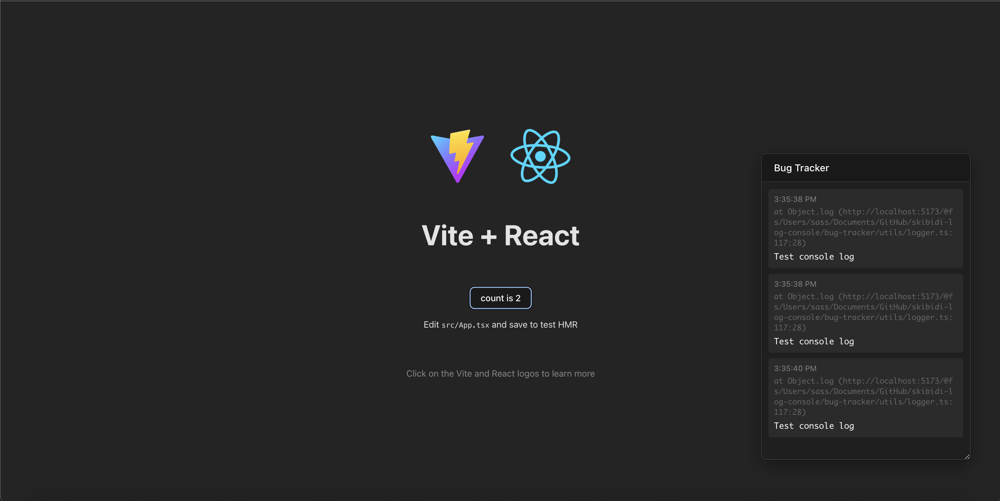
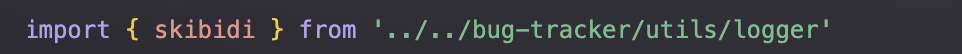

# Skibidi Log Console

An elegant and lightweight logging tool for JavaScript projects that allows you to view and monitor logs directly in your application without using the console.


## Demo

Here's how the logger looks in action with a Vite + React application:



The logger window appears in the top right corner, showing real-time logs from your application. In this example, you can see it working with a Vite + React application, displaying test console logs with precise timestamps and source locations.

## Features

- 🪟 Draggable and resizable window
- 🎨 Beautiful transparent design
- 🎯 Always on top functionality
- 🔍 Multiple log levels (info, warn, error, log)
- 📍 Precise location tracking in logs
- 🕒 Timestamps
- 🔄 Restart capability
- 📱 Responsive design

## Installation

1. Install the package via npm:

```bash
npm install skibidi-log-console
```

2. Import the logger into your project:

```javascript
import { skibidi } from 'skibidi-log-console';
```

or with CommonJS syntax:

```javascript
const { skibidi } = require('skibidi-log-console');
```

## Usage

### Basic Logging Functions

```javascript
// Standard log
skibidi.log('Hello world!');

// Info log (blue)
skibidi.info('Application started successfully');

// Warning (yellow)
skibidi.warn('Something went wrong, but not critical');

// Error (red)
skibidi.error('Critical error!', { error: 'Connection failed' });
```

### Logging Objects

```javascript
const user = {
    name: 'John',
    age: 30
};

skibidi.log('User info:', user);
```

### Multiple Arguments

```javascript
skibidi.info('User', 'logged in', { time: new Date(), ip: '192.168.1.1' });
```

## Customization

### Window Initial Position

By default, the window appears in the bottom right corner. You can modify this using CSS:

```css
.bug-tracker-window {
    position: fixed;
    top: 20px;    /* instead of bottom */
    left: 20px;   /* instead of right */
}
```

### Styles

All styles can be overridden in your CSS file. Main classes:

- `.bug-tracker-window` - main window
- `.bug-tracker-header` - window header
- `.bug-tracker-content` - logs container
- `.log-entry` - individual log entry
- `.log-entry.error` - error style
- `.log-entry.warn` - warning style
- `.log-entry.info` - info style

### Window Size

Default dimensions:
- Width: 340px
- Height: 480px
- Minimum width: 300px
- Minimum height: 200px

## Development Setup

1. Clone the repository:
```bash
git clone https://github.com/ManInBlack-coder/skibidi-log-console.git
```

2. Install dependencies:
```bash
cd skibidi-log-console
yarn
```

3. Start the development server:
```bash
yarn dev
```


## Integration Examples

1. add logger file import 



2. Then use it where ever you want in code 


3. and see output in skibidi log


## Known Issues

- Transparency issues might occur in Electron version on macOS Catalina and newer
- Some browsers don't support the backdrop-filter effect
- Window dragging might be inconsistent in certain browser versions

## License

MIT

## Authors

- Aleksander Potashenkov
- [ManInBlack-coder](https://github.com/ManInBlack-coder)

## Contributing

1. Fork the project
2. Create your feature branch (`git checkout -b feature/AmazingFeature`)
3. Commit your changes (`git commit -m 'Add some AmazingFeature'`)
4. Push to the branch (`git push origin feature/AmazingFeature`)
5. Open a Pull Request

